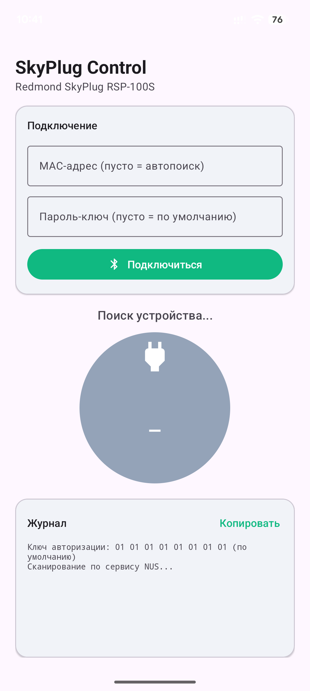

# SkyPlug Control — Redmond SkyPlug RSP-100S over BLE

A minimal Android app to control the **Redmond SkyPlug RSP-100S** smart socket
directly over Bluetooth LE — **no cloud, no account, no official ReadyForSky app required**.

This was built specifically for the **Redmond SkyPlug RSP-100S**, because the new
official app dropped support for it and the old one won't even let you log in. The BLE
protocol was reverse-engineered from the old ReadyForSky app.

## Compatibility

Confirmed working on the **Redmond SkyPlug RSP-100S**.

The same socket driver in the ReadyForSky app also covers **RSP-103S** and **RSP-121S**,
and the on/off/state commands are shared across the whole Redmond "Ready for Sky" socket
line, so other **Redmond SkyPlug** models will very likely work too — but only the
RSP-100S has been verified. Reports for other models are welcome.

## Features

- Auto-discovers the socket (by Nordic UART service UUID or by a name containing `RSP`),
  or connects directly by a MAC address you type in.
- Authenticates with an 8-byte key derived from a passphrase you type
  (SHA-256, first 8 bytes), persisted between launches. Leave it blank to use the
  built-in default key.
- A single round **toggle button** that shows the current state (green = on,
  red = off, grey = unknown/disconnected) and flips it on tap.
- HEX log of every frame sent/received, for debugging, with a "copy log" button.

## Screenshot

<!-- Put a screenshot at docs/screenshot.png and it will show up here -->


## How it works (protocol)

Redmond "Ready for Sky" devices use the **Nordic UART Service (NUS)**:

| Role | UUID |
|------|------|
| Service | `6e400001-b5a3-f393-e0a9-e50e24dcca9e` |
| Write (RX) | `6e400002-b5a3-f393-e0a9-e50e24dcca9e` |
| Notify (TX) | `6e400003-b5a3-f393-e0a9-e50e24dcca9e` |

Frame format: `0x55 | counter | command | [data] | 0xAA`
- `counter` — a byte 0..100, incremented per command; the device echoes it back.
- A response is "success" when its first data byte is non-zero.

Commands used:

| Action | Command | Example frame (counter = 0x01) |
|--------|---------|--------------------------------|
| Authenticate | `0xFF` + 8-byte key | `55 00 FF k k k k k k k k AA` |
| Turn ON | `0x03` | `55 01 03 AA` |
| Turn OFF | `0x04` | `55 01 04 AA` |
| Get state | `0x06` | `55 01 06 AA` |

The state response is parsed like the official app: `state == 2` means **ON**.

## Pairing & the key

The "pairing" here is **application-level auth**, not standard BLE bonding:

1. Put the socket into **pairing mode** (usually hold the button until the LED blinks).
   In this mode it memorizes whatever 8-byte key you send.
2. Connect with the app — it sends the key automatically.
3. From then on the socket accepts only that key, and remembers it across power cycles.
   You do **not** need pairing mode again on reconnect.

The key comes from a passphrase you type in the UI: the app hashes it with SHA-256 and
uses the first 8 bytes, so the same passphrase always yields the same key. Leaving the
field blank uses a built-in default key (`0101010101010101`).

Changing the passphrase produces different key bytes, so you must put the socket back
into pairing mode once after changing it. For anything beyond home use pick a non-trivial
passphrase — otherwise anyone nearby with this app could control the socket. Note BLE
traffic here is unencrypted, so the security is consumer-grade.

## Build

### Option A — Android Studio (easiest)
1. `File > Open` → select the `SkyPlugControl` folder.
2. Android Studio pulls Gradle 8.7, AGP 8.5.2, and SDK 34 automatically.
3. Connect a phone (USB debugging) → **Run ▶**.

### Option B — command line
Requires Gradle 8.7+ and a JDK 17–21:
```sh
gradle wrapper          # one-time, to generate gradlew
./gradlew assembleDebug
```
The APK lands in `app/build/outputs/apk/debug/app-debug.apk`. Install with:
```sh
adb install -r app/build/outputs/apk/debug/app-debug.apk
```

## Requirements

- Android 7.0+ (minSdk 24).
- On Android 12+ the app requests `BLUETOOTH_SCAN` / `BLUETOOTH_CONNECT`;
  on older versions it requests location (required by the system for BLE scanning).

## Related projects

The same protocol family is used by other Redmond devices; see Home Assistant
integrations such as [ClusterM/skykettle-ha](https://github.com/ClusterM/skykettle-ha)
and [mavrikkk/ha_kettler](https://github.com/mavrikkk/ha_kettler) (kettles/cookers).

## Disclaimer

Unofficial, not affiliated with Redmond. Reverse-engineered for interoperability with
hardware you own. Use at your own risk.

## License

MIT
